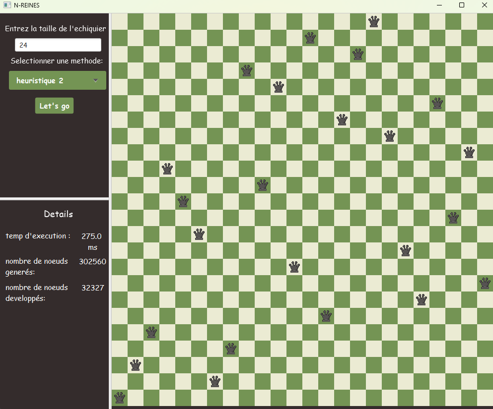

# Meta-project ♛

we used the N-queen Problem as a toy-problem for testing different optimisation techniques from naive ones like DFS and BFS to swarm itelligence like the genetic algorithm.

The goal in N-Queens problem is to place N queens on an N×N chessboard such to minimise queens threatening each other. This means two queens sharing the same row, column, or diagonal. 


## Prerequisite and Installation 🛠️

The project is divided in several modules:
- **Main**: This module contains the main class of the project. It is the one that will be executed, alongside with the algorithms .
- **GUI**: This module contains the classes that will be used to create the GUI of the project.


Prerequisite:
- javaFX

Run the ```interface.java``` file that is placed in ```src/main/java/GUI ```
    
## Examples ♟

we can choose the chessboard size and solution method: DFS,BFS,Heuristics, GA or PSO, the solution will be displayed on the chessboard with queens placed safely, metrics and statistics will be shown as well  


<p align="center">
  
</p>


<p align="center">
  
</p>

## License 📜

[MIT](https://choosealicense.com/licenses/mit/)

